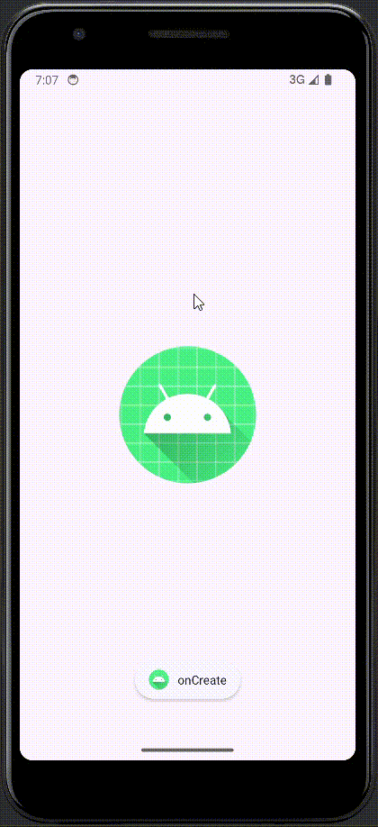
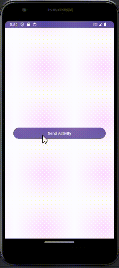

# 📱💻 Mobile application development - Module 4 Assignments 📱💻

## Team Members:

- Carlos Ignacio Padilla Herrera
- Giovanni Sebastian Verastegui Perez
- Alan Ulises Mendoza Gonzalez

## Exercise 2 - Graphic Components

### Objective:

The participant will practice the concepts of the main components used to design the graphical interfaces of an application. They will also reinforce the creation of graphical interfaces with basic, selection, and navigation components available in Android, using XML files.

### Instructions:

Create an Activity with its respective XML and design an interface for each point described below:

- Graphical interface design using FrameLayout
- Graphical interface design using LinearLayout
- Graphical interface design using RelativeLayout
- Graphical interface design using ConstrainLayout
- Graphical interface design using TextView, ImageView, EditText, Button, ImageButton, Checkbox, RadioButton, and Spinner.
- Graphical interface design using RecyclerView

### Additional Considerations:

- Use each component seen at least once.
- Creativity in the use of said component.
- The project can be shared via a public repository. Please share the link to your project repository so that it can be cloned without any issues by anyone for review.

### Evaluation Elements:

- FrameLayout: **1 point**
- LinearLayout: **1 point**
- RelativeLayout: **1 point**
- ConstrainLayout: **1 point**
- TextView, ImageView, EditText, Button, ImageButton, Checkbox, RadioButton, and Spinner: **3 points**
- RecyclerView: **3 points**

### Demo: (huge gif, wait for it to load. Can be seen in gif/optimized_demo.gif)

  

## Exercises 1 - Activities

### Objective 🎯:

The participant will learn to use the initial elements of an Android application, including the handling of the Manifest configuration file. Additionally, the participant will practice the concepts of Activity management, its lifecycle, and handling information through Intent by creating a project on the Android platform with Kotlin.

### Instructions 📋:

Create a project using the official Android Studio IDE that includes the following elements:

- An activity that implements its main lifecycle methods, each containing a "Toast" component that displays a text string corresponding to the state it has entered.
- An activity with a button that, when clicked, sends an implicit Intent to handle a URL in the browser.
- Two activities:
  - **Activity 1**: Creates Activity 2 and passes parameters. Additionally, it has the option to receive parameters returned at the end of Activity 2's execution.
  - **Activity 2**: Contains a button that, when clicked, finishes the activity's execution and returns information to Activity 1.

### Additional Considerations 🌟:

- Additional points will be given for managing a larger number/types of information between activities.
- The project can be shared via a public repository. Please share the repository link so it can be cloned without issues for review.

### Evaluation Elements 📝:

- Project creation and configuration: **2 points**
- Creation of implicit Intent: **2 points**
- Creation of Activities and information handling between them: **6 points**

### Recordings:

  
  
  

